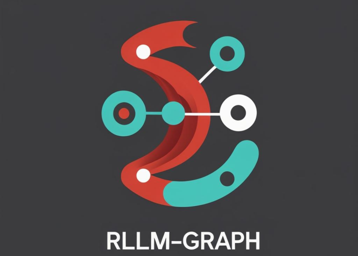

# rLLM-graph — Graph-based Rust LLM Orchestration

RLLM is a **Rust library for building and executing computation graphs** that combine **function nodes** (custom Rust logic) with **LLM nodes** (language model calls).
It provides a simple abstraction to model workflows as **nodes connected by edges**, with shared state management across the graph.

---

## ✨ Features

* 🧩 **Composable Graphs** – Build workflows with nodes and edges.
* 🔗 **Shared State** – All nodes read/write from a thread-safe `State`.
* ⚡ **Async Execution** – Runs with `tokio` for high performance.
* 🤖 **LLM Integration** – Define prompts with variables automatically filled from state.
* 🔧 **Function Nodes** – Plug in custom Rust functions.

---

## 📦 Installation

Add the following to your `Cargo.toml`:

```toml
[dependencies]
rllm = { git = "https://github.com/mainak55512/rLLM-graph" }
tokio = { version = "1", features = ["full"] }
dotenv = "0.15"
serde_json = "1"
```

---

## 🚀 Quick Start

Here’s a minimal example that sets a state variable, queries an LLM, and logs the result:

```rust
use dotenv::dotenv;
use rllm::{FunctionNode, GraphBuilder, LLMNode, RLLMError, SharedState};
use std::env;

#[tokio::main]
async fn main() -> Result<(), RLLMError> {
    dotenv().ok();
    let endpoint = env::var("END_POINT")?;
    let api_key = "Bearer ".to_string() + &env::var("API_KEY")?;

    // Creating a FunctionNode to set "location"
    let set_location_node =
        FunctionNode::new(Box::new(|state: SharedState| -> Result<(), RLLMError> {
            match state.lock() {
                Ok(mut context_state) => {
                    context_state.set_rllm_string("location", "America".to_string())?;
                }
                Err(_) => println!("Couldn't aquire lock!"),
            }
            Ok(())
        }));

    // Creating LLMNode
    let mut llm_node = LLMNode::new(endpoint, api_key);
    llm_node.set_model("llama-3.3-70b-versatile".to_string());
    llm_node.set_prompt(
        "What's the capital of {}?".to_string(),
        vec!["location".to_string()],
    );

    // Creating FunctionNode to print the LLM Output
    let log_fn = FunctionNode::new(Box::new(|state: SharedState| -> Result<(), RLLMError> {
        match state.lock() {
            Ok(context_state) => {
                println!("{}", context_state.get_llm_response()?);
            }
            Err(_) => println!("Couldn't aquire lock!"),
        }
        Ok(())
    }));

    // Building Graph
    let mut g_build = GraphBuilder::new();
    g_build.add_node("A".to_string(), Box::new(set_location_node));
    g_build.add_node("B".to_string(), Box::new(llm_node));
    g_build.add_node("C".to_string(), Box::new(log_fn));
    g_build.add_edge(("A".to_string(), "B".to_string()));
    g_build.add_edge(("B".to_string(), "C".to_string()));
    let graph = g_build.build();

    // Running the graph
    graph.run().await?;

    Ok(())
}
```

---

## 🏗 Core Concepts

### **State**

A thread-safe key–value store (`Arc<Mutex<State>>`) holding variables and LLM responses.
Provides typed getters and setters:

* `set_rllm_string`, `set_rllm_number`, `set_rllm_bool`, `set_rllm_json`
* `get_rllm_string`, `get_rllm_number`, `get_rllm_bool`, `get_rllm_json`
* `get_llm_response`, `set_llm_response`

---

### **Nodes**

Nodes are units of computation.

* **`FunctionNode`**: Runs a Rust closure with access to shared state.
* **`LLMNode`**: Calls an LLM API endpoint with a prompt that may include placeholders filled from state.

Both implement the async `Node` trait:

```rust
#[async_trait]
pub trait Node {
    async fn execute(&self, state: SharedState) -> Result<(), RLLMError>;
}
```

---

### **Graph**

Defines the execution flow:

* **`GraphBuilder`**: Add nodes and edges, then build a `Graph`.
* **`Graph`**: Runs the nodes in dependency order, passing around shared state.

---

## 🔮 Example Use Cases

* Chain multiple LLM calls with intermediate logic.
* Build function + LLM pipelines (retrieval, reasoning, and actions).
* Represent AI workflows as DAGs (Directed Acyclic Graphs).

---


## 📜 License

MIT License © 2025 Mainak Bhattacharjee

---
